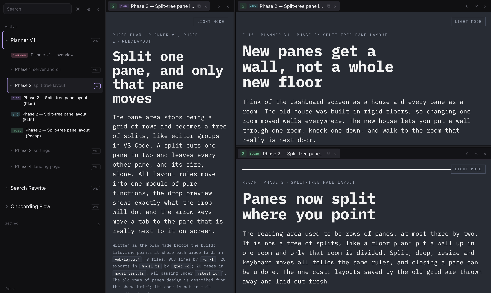
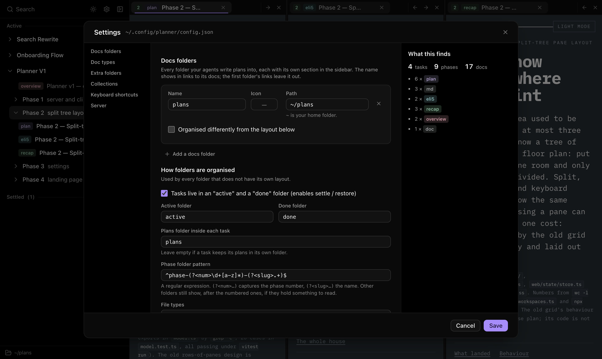
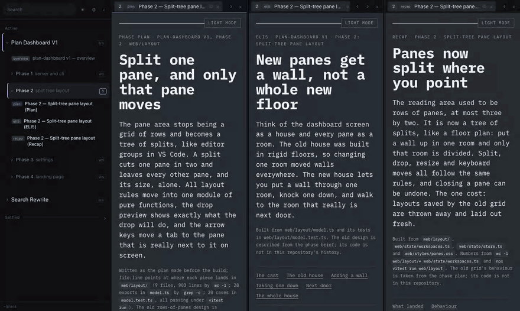
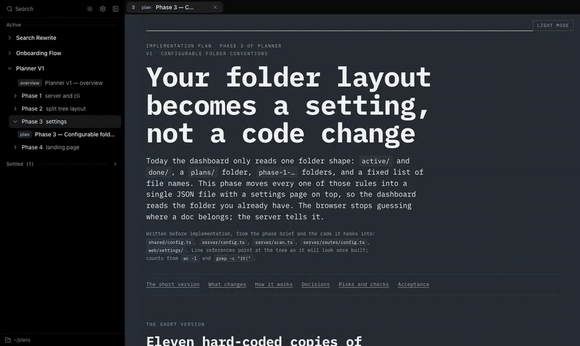
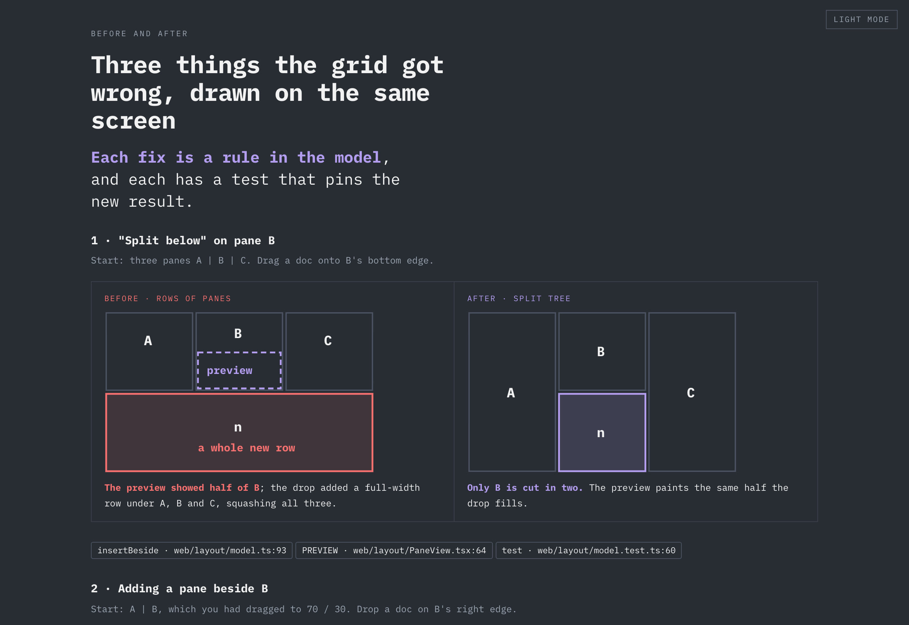
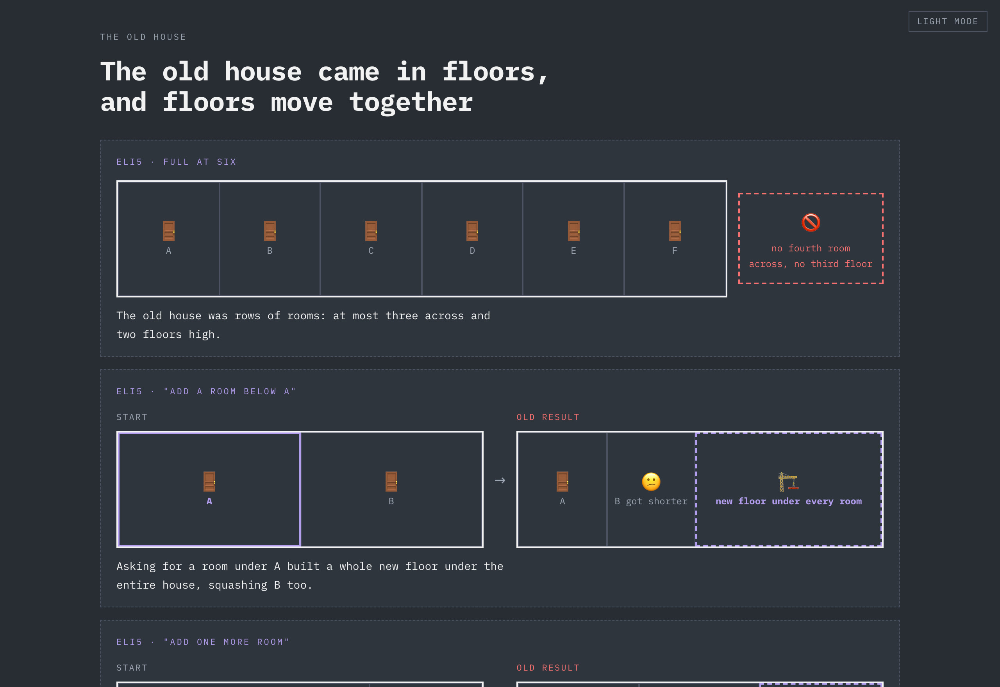

# Planner

Read a folder of HTML and Markdown plans side by side, in split panes, and see new ones the moment they are written.

Built for working with coding agents that write plans, recaps and explainers as files: point it at the folder they
write into and keep it open next to your editor.

**[Website](https://limyuquan.github.io/planner/)** · [Install](#quick-start) · [Agent skills](#agent-skills) ·
[llms.txt](https://limyuquan.github.io/planner/llms.txt)



- **Split panes** like an editor: split any pane right or down, drag tabs between panes and onto any edge, resize
  freely.
- **Workspaces**: each phase of a task is a workspace. Opening one lays out all its plans at once, and your
  arrangement is remembered per phase.
- **Live**: new plans raise a notification, edited plans reload in place, and scroll positions are kept.
- **Linkable**: the address bar always names the plan on screen, so a link can be pasted into a chat or written into
  another plan — and `planner open <link>` shows it in the tab you already have open.
- **Your folder layout**: folder names, phase naming and file types are settings, not code.

## Why I built this

I built this at work, for myself. Once coding agents were writing most of the code, writing code stopped being the slow
part of my day. Reviewing their plans was. Every task produced a plan, then an explainer, then a recap, spread across
folders, and I was skimming them in an editor tab, or not reading them at all. That is how you stop knowing what your
own codebase is turning into.

I wanted reviewing to be fast enough that I would actually do it, every time. So the agents write each plan as a
readable HTML page ([the skill they use](#agent-skills) is in this repo), the dashboard shows it the moment it lands,
and I read a whole phase side by side instead of opening files one at a time. It keeps me in the loop without slowing
the agents down.

## Quick start

Needs Node.js 20.19 or newer.

```sh
npm install -g https://github.com/limyuquan/planner/releases/latest/download/planner.tgz
planner
```

`planner` opens in your browser and asks for your docs folder. Or add folders from the terminal with
`planner config add <folder>`, or let your agent do it: give it the [`planner-setup`](skills/planner-setup) skill and ask
it to set Planner up. To update, run the install line again.

To try it on the demo folder, or to work on Planner itself:

```sh
git clone https://github.com/limyuquan/planner
cd planner
npm install
npm run build
node dist/cli.js --root examples/demo-docs
```

## How your docs are read

Planner reads one or more **docs folders**, for example one per project, each with its own section in the sidebar. By
default it expects each folder laid out like this; all of it can be changed, for every folder or for one, in **Settings**
(⚙) or the config file:

```text
<docs folder>/
├── active/                       # tasks in progress   ┐ "status folders": settle / restore
├── done/                         # finished tasks      ┘ moves a task between them
│   └── <task>/
│       ├── plans/
│       │   ├── mother-plan.html  # task-level docs: the task's own workspace
│       │   ├── phase-1-setup/    # a phase: its own workspace
│       │   │   ├── plan.html
│       │   │   └── recap.md
│       │   └── phase-2-api/
│       └── research/             # an extra folder with its own section
```

- A **doc** is any file with a listed extension (`html` and `md` by default). HTML is shown as written; Markdown is
  rendered in Planner's theme. Other types (`pdf`, `txt`, images) can be added and show as the browser shows
  them.
- A doc's label in the sidebar is its `<title>`, or the first `#` heading of a Markdown file.
- **Doc types** give a doc a coloured badge by file name (`plan.html` → _plan_, `eli5*.html` → _eli5_, …). Their order
  is the order docs are listed and laid out in.
- **Phases** are folders matching the phase pattern, a regular expression with a `num` group
  (`^phase-(?<num>\d+[a-z]*)-(?<slug>.+)$`). `phase-1a-…` sorts after `phase-1-…` and before `phase-2-…`.
- **Collections** list docs outside any task by a path pattern, e.g. `weekly/*/*.html`.

The settings page previews what a change would find before you save it, including folders the phase pattern misses and
files left out. `planner config check` prints the same from a terminal.



## Using it

<p align="center"></p>

- Click a doc to open it in the focused pane; shift-click (or `⇥`) opens it in the next pane, splitting one off if
  needed.
- `ws` beside a task or phase makes it your workspace. On the workspace you are in it becomes `↺`, which lays it out
  again from its docs (with Undo).
- Drag a tab onto a pane's edge to split it there, onto its middle to move it in, or along a tab strip to reorder.
  The highlight shows exactly the space the tab will take.
- Pane buttons: chevrons move the shown tab to the neighbouring pane, `⊞` `⊟` split it off right or below, `×` closes
  the pane (with Undo).
- `settle` / `restore` move a task's folder between the status folders; open tabs follow it.
- `⧉` copies the absolute path of a file or folder.
- `☺` on a task gives it an icon; doc types and docs folders can have one too, in Settings.

<p align="center"></p>

### Keyboard

Every shortcut can be changed in **Settings** (⚙ → Keyboard shortcuts, where you record a combo by pressing it) or under
`hotkeys` in the config file. These are the defaults:

| Keys                           | Does                                                                 |
| ------------------------------ | -------------------------------------------------------------------- |
| `Ctrl`/`Option` + arrow        | Move the shown tab one pane that way, splitting a new pane if needed |
| `Option` + `Shift` + `→` / `←` | Next / previous tab in the focused pane                              |
| `Option` + `W`                 | Close the shown tab                                                  |
| `Ctrl` + `1`…`9`               | Open the nth phase of the current task                               |
| `Option` + `B`                 | Show or hide the sidebar                                             |
| `/`                            | Jump to the search box                                               |
| _(unbound)_                    | Split the shown tab right / down                                     |
| Middle click on a tab          | Close it                                                             |

Shortcuts also work while a plan has focus, but never while you type in a field. Combos are written like `"Alt+W"`
(`Alt` is `Option` on a Mac) and match the physical key.

## Links

The address bar always names what is on screen:

```text
?ws=<task>[/<folder>]&plan=<file>   # a doc in a workspace, by file name ("plan" finds plan.html, then plan.md)
?ws=<task>[/<folder>]               # just the workspace
?doc=<path>                         # any other file: relative to the docs folder, or an absolute path
```

Workspace names leave out the status folder, so links keep working after a task is settled.

`planner open '<link>'` sends a link to the dashboard tab that is already open instead of opening another one
(and starts the dashboard if it is not running). On macOS it also brings that Chrome tab to the front. Agents can use
it to show you what they wrote.

Links inside a plan open as tabs: relative links, links to `/docs/...`, absolute paths on your machine that point into
the docs folder, and dashboard links. Links to other sites open in a browser tab.

### Theme hand-off for HTML docs

A doc is loaded with `?theme=dark|light`, and receives `{ type: 'plan-theme', theme }` by `postMessage` when the
dashboard's theme changes. A doc can post the same message to its parent to switch the dashboard.

## Agent skills

[`skills/`](skills) holds the agent skills I use with Planner. Use them as they are, or as a starting point for your own:

- [`visualise`](skills/visualise) has an agent turn a plan, a diff or a codebase into one self-contained HTML page in a
  consistent style: a plan before implementation, a recap after it, a codebase map, an explainer, an ELI5 picture page,
  or a review with selectable findings. [`render/GUIDE.md`](skills/visualise/render/GUIDE.md) is the full brief the
  writing agent follows, and [`render/base.html`](skills/visualise/render/base.html) shows every component once (open
  it in a browser).
- [`link-plan`](skills/link-plan) tells the agent to show you what it wrote with `planner open`, instead of
  pasting a file path.
- [`planner-setup`](skills/planner-setup) lets an agent set Planner up for you: it finds the folders your plans live
  in, works out how each is organised, writes the config and checks it with `planner config check` until every folder
  shows what is really there.

<p> </p>

The demo folder's `planner-v1` task was written this way, about this project's own build.

They use the `SKILL.md` format that Claude Code and Codex read: copy a folder into your agent's skills directory (for
example `~/.claude/skills/`). Pages made with `visualise` follow Planner's light/dark switch through the theme
hand-off above.

## Command line

```text
planner [--root <folder>]... [--port <number>] [--config <file>] [--no-open]
planner open <link>

planner config path            where the config file is
planner config show            print it
planner config add <folder>    add a docs folder (--name <name> to name it)
planner config remove <name>   remove one
planner config check           validate, then print what each folder holds; exits non-zero on problems
planner config schema          the JSON schema, with a description of every key
```

`--root` (repeatable) and `--port` apply to one run only and are never saved. The server listens on `localhost` only.

### Local HTTP API

What the CLI and the web app use, for scripts and agents. Doc paths are `<folder name>/<path inside it>`; requests that
change something must come from the page itself (same origin).

| Request                        | Does                                                                                      |
| ------------------------------ | ----------------------------------------------------------------------------------------- |
| `GET /api/open?ws=&plan=&doc=` | Shows a link in the open Planner tab; replies `{ listeners }` (0 means no tab heard it)   |
| `GET /api/tree`                | Every folder, task, phase and doc, plus `configProblem` when the config file has an error |
| `GET /api/doc?path=`           | Describes one doc, by doc path or by absolute path                                        |
| `GET /docs/<folder>/<path>`    | The file itself; Markdown comes back rendered as HTML (`?theme=dark\|light`)              |
| `GET /api/events`              | Server-sent events: `tree`, `added` (a new doc), `changed` (a doc was edited), `open`     |
| `POST /api/move`               | `{ "task": "<folder>:<task>", "to": "done" \| "active" }` settles or restores a task      |
| `GET /api/config`              | The saved config and the file's location                                                  |
| `PUT /api/config`              | Saves a whole config after checking it; 400 with the problems if it is invalid            |
| `POST /api/config/preview`     | What a draft config would find in each folder, without saving it                          |

## Configuration

Settings live in `~/.config/planner/config.json` (or under `$XDG_CONFIG_HOME`). The settings page, `planner config`
and you can all edit it; a running Planner picks up changes by itself. A file with an error is not applied: Planner
keeps the last good settings and says so in the sidebar until it is fixed. The file names its
[JSON schema](schema/config.schema.json) in `$schema`, so editors and agents can check it as they write.

```json
{
  "folders": [
    { "name": "work", "path": "~/code/work/docs" },
    { "name": "side", "path": "~/code/side-project/plans", "statusFolders": null, "plansFolder": "" }
  ],
  "phasePattern": "^phase-(?<num>\\d+[a-z]*)-(?<slug>.+)$"
}
```

Only the keys you change are needed; the rest are the defaults.

| Key             | Default                                 | Meaning                                                                                                                    |
| --------------- | --------------------------------------- | -------------------------------------------------------------------------------------------------------------------------- |
| `folders`       | `[]`                                    | Docs folders: `name` (shown in the sidebar and links), `path`, an optional `icon`, and any layout key below to override it |
| `statusFolders` | `{"active":"active","done":"done"}`     | Folders holding active and finished tasks; `null` if tasks sit directly in the docs folder                                 |
| `plansFolder`   | `"plans"`                               | Folder inside each task holding its plans; `""` for the task folder itself                                                 |
| `phasePattern`  | `^phase-(?<num>\d+[a-z]*)-(?<slug>.+)$` | Phase folder names; `(?<num>…)` is the phase number, `(?<slug>…)` its name                                                 |
| `fileTypes`     | `["html","md"]`                         | Extensions to show                                                                                                         |
| `groups`        | Research → `research/`, HTML only       | Extra folders in each task with their own section                                                                          |
| `collections`   | `[]`                                    | Docs outside any task, by path pattern, e.g. `{"label":"Weekly","path":"weekly/*/*.html"}`                                 |
| `docTypes`      | plan, eli5, recap, md, …                | Badges by file name, each with an optional `icon`; the first match wins, and the order is the reading order                |
| `port`          | `4173`                                  | Port to listen on                                                                                                          |
| `hotkeys`       | see Keyboard                            | Shortcuts by action, e.g. `{"closeTab": ["Alt+Q"], "splitRight": ["Alt+\\"]}`; `[]` turns one off                          |
| `taskIcons`     | `{}`                                    | Icons for tasks by `"<folder>:<task>"`, e.g. `{"work:search-rewrite": "🔎"}`; also set from the ☺ on a task row            |

Links name a workspace as `?ws=<task>/<phase>` in the first folder and `?ws=<folder>:<task>/<phase>` in the others, so a
single-folder setup's links never change.

## Development

```sh
npm run dev -- --root examples/demo-docs   # server + hot reload on http://localhost:4173
npm test
npm run lint
npm run typecheck
```

See [CONTRIBUTING.md](CONTRIBUTING.md) for how the code is laid out.

## License

[MIT](LICENSE)
